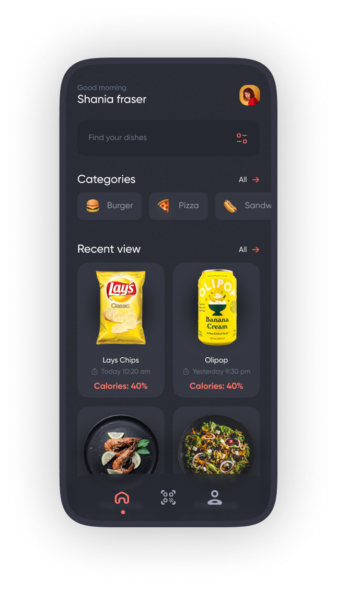
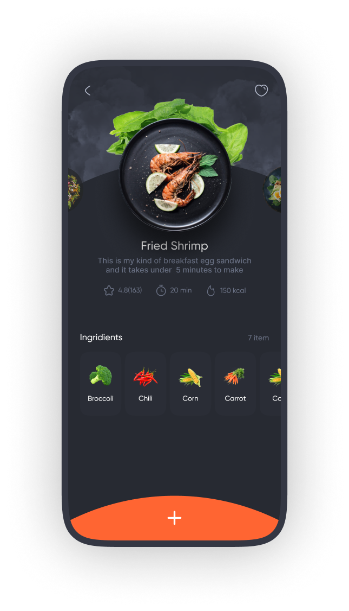
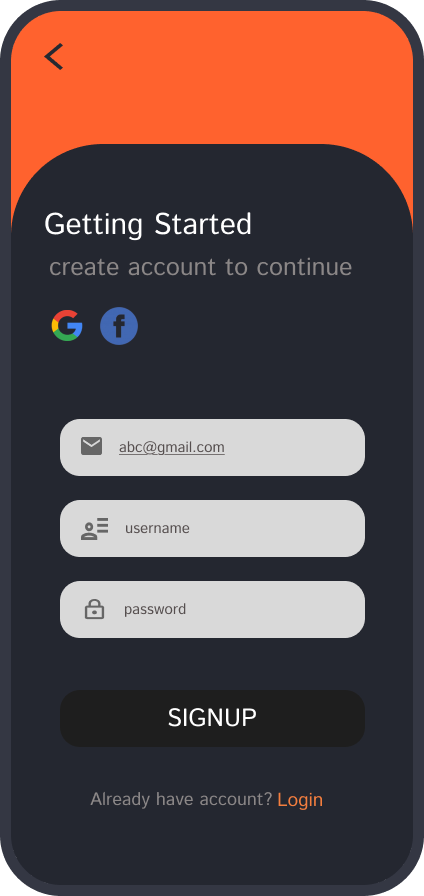
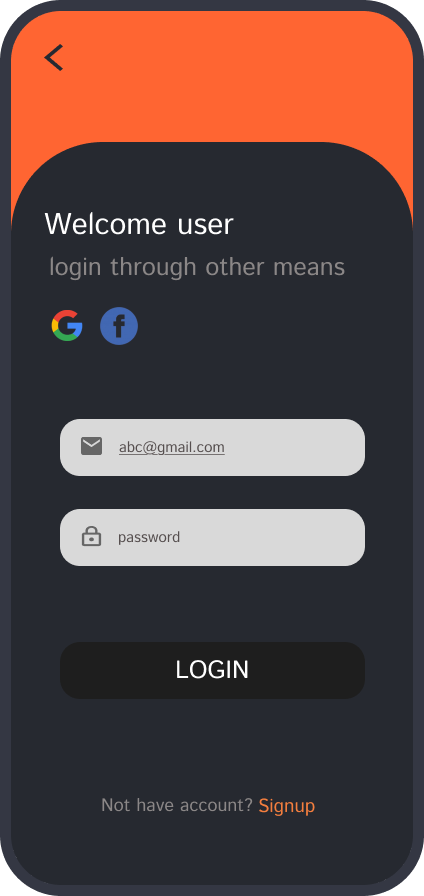
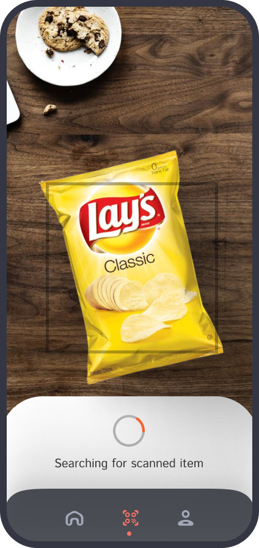
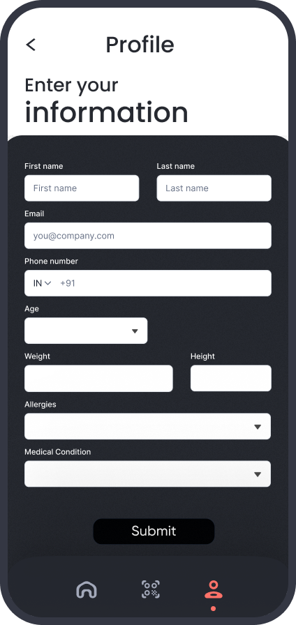

# 🍽️ FoodFreaks - Smart Food Scanner App

**FoodFreaks** is a Flutter-based mobile app that empowers users to make healthier dietary choices by instantly scanning food items—both packaged and plated—to receive personalized nutritional insights, allergy alerts, and diet recommendations.

---

## 🔍 Problem Statement

In today’s fast-paced world, people struggle to make informed food choices due to complex and generic nutritional labels. FoodFreaks solves this by providing real-time, personalized feedback based on the user's medical history, allergies, and preferences.

---

## 🧠 Key Features

- **📷 Scan Food Items**: Instantly scan food packets or real meals (e.g., pizza) using camera-based detection.
- **👩‍⚕️ Personalized Recommendations**: Tailored advice based on user's health conditions, allergies, and goals.
- **🍬 Calorie & Sugar Tracking**: Real-time breakdown of calories, sugar, and other nutrition metrics.
- **📋 Health Profile Tracking**: Users can input and manage health data for improved recommendations.
- **🤖 AI-Powered Recognition**: Food classification and breakdown using machine learning (TensorFlow).
- **🧾 History & Logs**: Keeps a record of scanned items and nutritional history.
- **🌐 Google & Facebook Authentication**: Easy onboarding via Firebase.

---

## 🚀 Tech Stack

| Layer             | Technology         |
|------------------|--------------------|
| Frontend         | Flutter (Dart)     |
| Backend          | Firebase           |
| Auth & Cloud     | Firebase Auth + FCM|
| AI/ML            | Python + TensorFlow|
| Design           | Figma              |

---

## 📲 UI Screenshots

| Home Screen | Food Details |
|-------------|--------------|
|  |  |

| Signup | Login |
|--------|-------|
|  |  |

| Scan View | Profile Form |
|-----------|--------------|
|  |  |

## 🛠️ Setup Instructions

### Prerequisites

- Flutter SDK (>=3.0.0)
- Android Studio or VSCode
- Firebase Project
- Python (for model training, optional)

---
